# [📈 Live Status](https://Certania.github.io/status-website): <!--live status--> **🟧 Partial outage**

This repository contains the open-source uptime monitor and status page for [CERTANIA](certania.com), powered by [Upptime](https://github.com/upptime/upptime).

With [Upptime](https://upptime.js.org), you can get your own unlimited and free uptime monitor and status page, powered entirely by a GitHub repository. We use [Issues](https://github.com/Certania/status-website/issues) as incident reports, [Actions](https://github.com/Certania/status-website/actions) as uptime monitors, and [Pages](https://Certania.github.io/status-website) for the status page.

<!--start: status pages-->
<!-- This summary is generated by Upptime (https://github.com/upptime/upptime) -->
<!-- Do not edit this manually, your changes will be overwritten -->
<!-- prettier-ignore -->
| URL | Status | History | Response Time | Uptime |
| --- | ------ | ------- | ------------- | ------ |
|  [CERTANIA](https://certania.com) | 🟩 Up | [certania.yml](https://github.com/Certania/status-website/commits/HEAD/history/certania.yml) | 

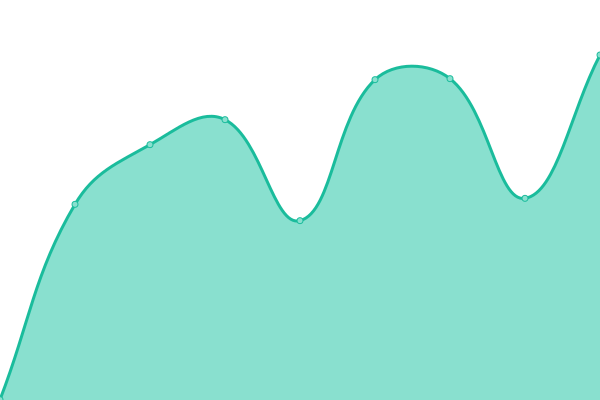 754ms
     
 | 

<a href="https://Certania.github.io/status-website/history/certania">99.69%</a>
    

|  [ALPHALYTIK](https://www.alphalytik.com/) | 🟩 Up | [alphalytik.yml](https://github.com/Certania/status-website/commits/HEAD/history/alphalytik.yml) | 

 1588ms
     
 | 

<a href="https://Certania.github.io/status-website/history/alphalytik">99.06%</a>
    

|  [Bioarray](https://bioarray.es/) | 🟩 Up | [bioarray.yml](https://github.com/Certania/status-website/commits/HEAD/history/bioarray.yml) | 

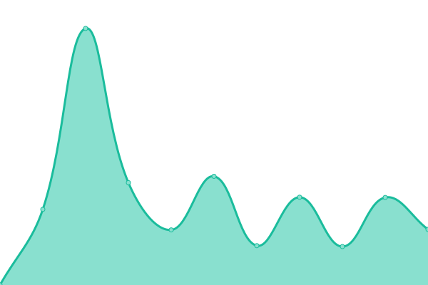 1138ms
     
 | 

<a href="https://Certania.github.io/status-website/history/bioarray">99.25%</a>
    

|  [DINOX](https://www.dinox.de/) | 🟩 Up | [dinox.yml](https://github.com/Certania/status-website/commits/HEAD/history/dinox.yml) | 

 1663ms
     
 | 

<a href="https://Certania.github.io/status-website/history/dinox">100.00%</a>
    

|  [GBD](https://www.gbd-biotechdia.com/) | 🟩 Up | [gbd.yml](https://github.com/Certania/status-website/commits/HEAD/history/gbd.yml) | 

 1326ms
     
 | 

<a href="https://Certania.github.io/status-website/history/gbd">100.00%</a>
    

|  [Groupe Icare](https://www.groupeicare.com) | 🟩 Up | [groupe-icare.yml](https://github.com/Certania/status-website/commits/HEAD/history/groupe-icare.yml) | 

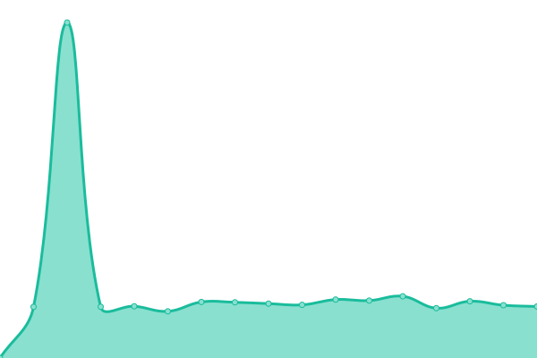 3452ms
     
 | 

<a href="https://Certania.github.io/status-website/history/groupe-icare">100.00%</a>
    

|  [ÖHMI Pharma](https://www.oehmi-analytik.de/leistungen/pharma-und-umweltlabor) | 🟩 Up | [oe-hmi-pharma.yml](https://github.com/Certania/status-website/commits/HEAD/history/oe-hmi-pharma.yml) | 

 1345ms
     
 | 

<a href="https://Certania.github.io/status-website/history/oe-hmi-pharma">99.60%</a>
    

|  [SOCRAMETRICS](https://socrametrics.com/) | 🟩 Up | [socrametrics.yml](https://github.com/Certania/status-website/commits/HEAD/history/socrametrics.yml) | 

 793ms
     
 | 

<a href="https://Certania.github.io/status-website/history/socrametrics">99.76%</a>
    

|  [SOCRATEC R&D](https://socratec-pharma.de/) | 🟩 Up | [socratec-r-and-d.yml](https://github.com/Certania/status-website/commits/HEAD/history/socratec-r-and-d.yml) | 

 1534ms
     
 | 

<a href="https://Certania.github.io/status-website/history/socratec-r-and-d">100.00%</a>
    

|  [Pharmsoft](http://www.pharmsoft.eu/) | 🟩 Up | [pharmsoft.yml](https://github.com/Certania/status-website/commits/HEAD/history/pharmsoft.yml) | 

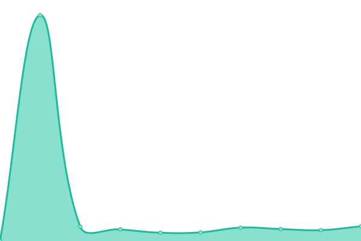 928ms
     
 | 

<a href="https://Certania.github.io/status-website/history/pharmsoft">100.00%</a>
    

|  [SPINESERV](https://www.spineserv.de/) | 🟩 Up | [spineserv.yml](https://github.com/Certania/status-website/commits/HEAD/history/spineserv.yml) | 

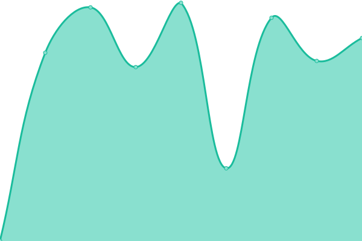 1576ms
     
 | 

<a href="https://Certania.github.io/status-website/history/spineserv">100.00%</a>
    

|  [BIOTEC](https://www.biotec-gmbh.com/) | 🟩 Up | [biotec.yml](https://github.com/Certania/status-website/commits/HEAD/history/biotec.yml) | 

 887ms
     
 | 

<a href="https://Certania.github.io/status-website/history/biotec">100.00%</a>
    

|  [BIOTESYS](https://biotesys.de/) | 🟩 Up | [biotesys.yml](https://github.com/Certania/status-website/commits/HEAD/history/biotesys.yml) | 

 2085ms
     
 | 

<a href="https://Certania.github.io/status-website/history/biotesys">99.67%</a>
    

|  [ELAB-ANALYTIK](https://elab-analytik.de/) | 🟩 Up | [elab-analytik.yml](https://github.com/Certania/status-website/commits/HEAD/history/elab-analytik.yml) | 

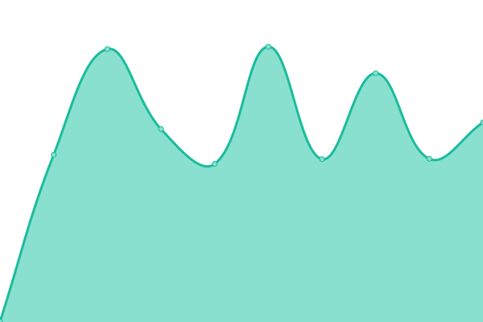 741ms
     
 | 

<a href="https://Certania.github.io/status-website/history/elab-analytik">100.00%</a>
    

|  [FSI HEALTH & SAFETY​](https://fsi.de/) | 🟩 Up | [fsi-health-and-safety.yml](https://github.com/Certania/status-website/commits/HEAD/history/fsi-health-and-safety.yml) | 

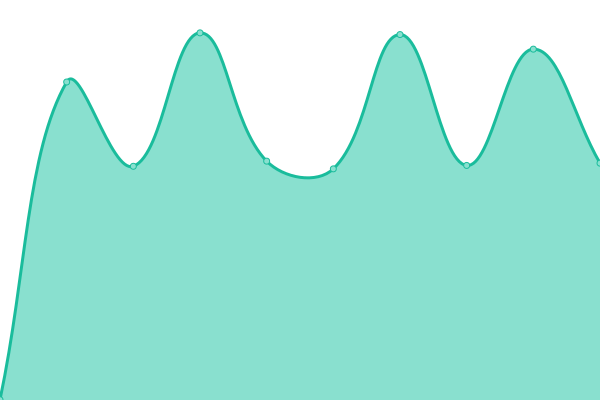 1000ms
     
 | 

<a href="https://Certania.github.io/status-website/history/fsi-health-and-safety">100.00%</a>
    

|  [INSTITUT DR. NUSS](https://www.institut-nuss.de/) | 🟩 Up | [institut-dr-nuss.yml](https://github.com/Certania/status-website/commits/HEAD/history/institut-dr-nuss.yml) | 

 7788ms
     
 | 

<a href="https://Certania.github.io/status-website/history/institut-dr-nuss">99.44%</a>
    

|  [LABOSPORT](https://labosport.com/) | 🟩 Up | [labosport.yml](https://github.com/Certania/status-website/commits/HEAD/history/labosport.yml) | 

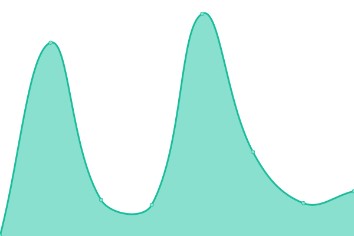 687ms
     
 | 

<a href="https://Certania.github.io/status-website/history/labosport">100.00%</a>
    

|  [Linge](https://lingeagroconsultancy.nl) | 🟩 Up | [linge.yml](https://github.com/Certania/status-website/commits/HEAD/history/linge.yml) | 

 1456ms
     
 | 

<a href="https://Certania.github.io/status-website/history/linge">100.00%</a>
    

|  [Mediator](https://www.mediator.as/) | 🟩 Up | [mediator.yml](https://github.com/Certania/status-website/commits/HEAD/history/mediator.yml) | 

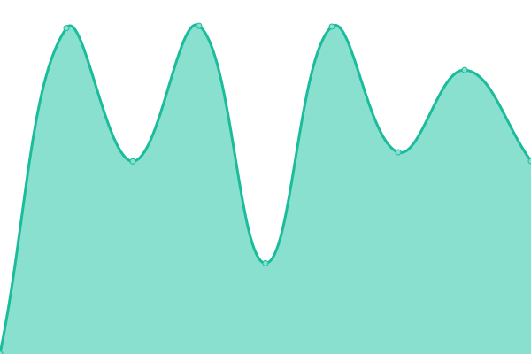 1069ms
     
 | 

<a href="https://Certania.github.io/status-website/history/mediator">100.00%</a>
    

|  [ÖHMI ANALYTIK](https://www.oehmi-analytik.de) | 🟩 Up | [oe-hmi-analytik.yml](https://github.com/Certania/status-website/commits/HEAD/history/oe-hmi-analytik.yml) | 

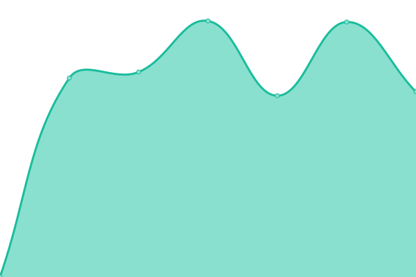 1320ms
     
 | 

<a href="https://Certania.github.io/status-website/history/oe-hmi-analytik">100.00%</a>
    

|  [RAS-SCI](https://www.supplychainintegrity.eu) | 🟩 Up | [ras-sci.yml](https://github.com/Certania/status-website/commits/HEAD/history/ras-sci.yml) | 

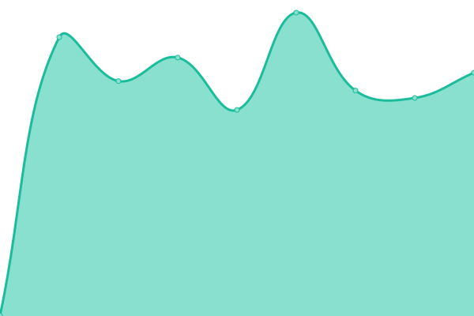 543ms
     
 | 

<a href="https://Certania.github.io/status-website/history/ras-sci">99.69%</a>
    

|  [SGI COMPLIANCE​](https://sgicompliance.com/) | 🟥 Down | [sgi-compliance.yml](https://github.com/Certania/status-website/commits/HEAD/history/sgi-compliance.yml) | 

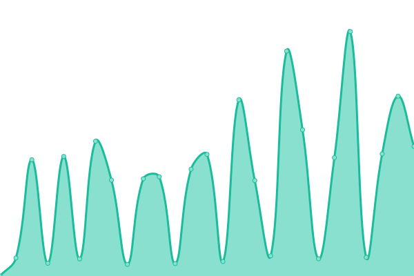 0ms
     
 | 

<a href="https://Certania.github.io/status-website/history/sgi-compliance">0.00%</a>
    

|  [TRISKELION](https://www.triskelion.nl/) | 🟥 Down | [triskelion.yml](https://github.com/Certania/status-website/commits/HEAD/history/triskelion.yml) | 

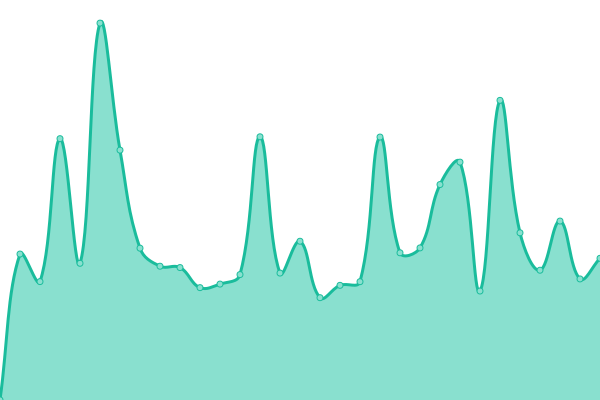 1804ms
     
 | 

<a href="https://Certania.github.io/status-website/history/triskelion">91.72%</a>
    

|  [DFGE](https://dfge.de/) | 🟩 Up | [dfge.yml](https://github.com/Certania/status-website/commits/HEAD/history/dfge.yml) | 

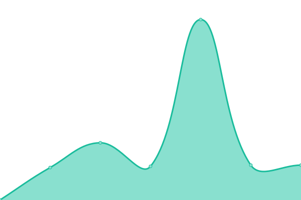 1093ms
     
 | 

<a href="https://Certania.github.io/status-website/history/dfge">99.74%</a>
    

|  [NATUREOFFICE](https://natureoffice.com/) | 🟩 Up | [natureoffice.yml](https://github.com/Certania/status-website/commits/HEAD/history/natureoffice.yml) | 

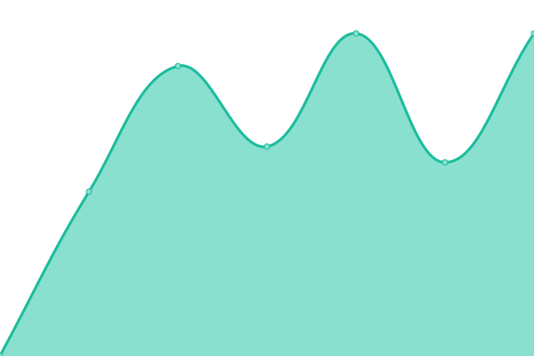 1184ms
     
 | 

<a href="https://Certania.github.io/status-website/history/natureoffice">100.00%</a>
    

|  [Terra Institute](https://terra-institute.eu) | 🟩 Up | [terra-institute.yml](https://github.com/Certania/status-website/commits/HEAD/history/terra-institute.yml) | 

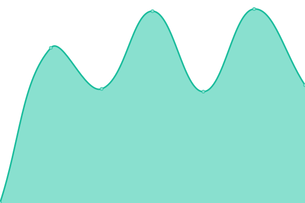 1187ms
     
 | 

<a href="https://Certania.github.io/status-website/history/terra-institute">100.00%</a>
    

|  [CERTURIA](https://www.certuria.de/) | 🟩 Up | [certuria.yml](https://github.com/Certania/status-website/commits/HEAD/history/certuria.yml) | 

 2585ms
     
 | 

<a href="https://Certania.github.io/status-website/history/certuria">99.79%</a>
    

|  [IFU CERT](https://www.ifu-cert.de/) | 🟩 Up | [ifu-cert.yml](https://github.com/Certania/status-website/commits/HEAD/history/ifu-cert.yml) | 

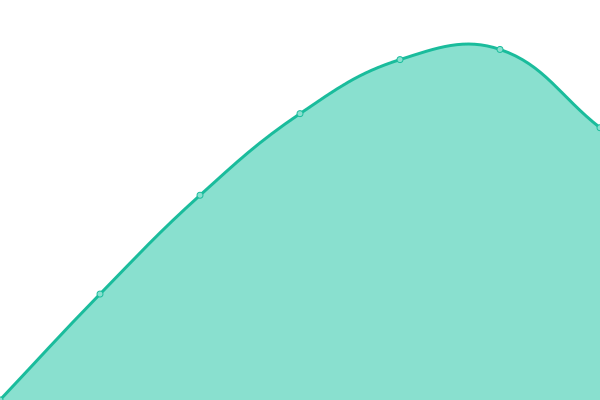 2120ms
     
 | 

<a href="https://Certania.github.io/status-website/history/ifu-cert">100.00%</a>
    

|  [ÖHMI EUROCERT](https://www.oehmi-cert.de/de/) | 🟩 Up | [oe-hmi-eurocert.yml](https://github.com/Certania/status-website/commits/HEAD/history/oe-hmi-eurocert.yml) | 

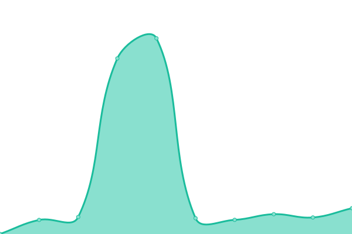 1858ms
     
 | 

<a href="https://Certania.github.io/status-website/history/oe-hmi-eurocert">100.00%</a>
    

|  [BB7](https://bbseven.com) | 🟩 Up | [bb-7.yml](https://github.com/Certania/status-website/commits/HEAD/history/bb-7.yml) | 

 1112ms
     
 | 

<a href="https://Certania.github.io/status-website/history/bb-7">100.00%</a>
    

|  [CMC Sud](https://www.cmcsud.com/) | 🟩 Up | [cmc-sud.yml](https://github.com/Certania/status-website/commits/HEAD/history/cmc-sud.yml) | 

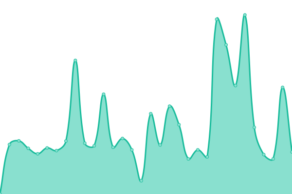 3163ms
     
 | 

<a href="https://Certania.github.io/status-website/history/cmc-sud">98.84%</a>
    

|  [C-Tec](https://c-tec-ndt.de) | 🟩 Up | [c-tec.yml](https://github.com/Certania/status-website/commits/HEAD/history/c-tec.yml) | 

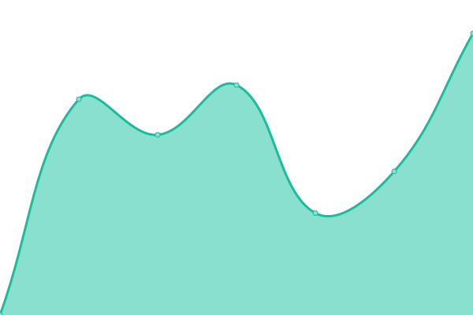 2380ms
     
 | 

<a href="https://Certania.github.io/status-website/history/c-tec">100.00%</a>
    

|  [Clarke Banks](https://www.clarkebanks.com) | 🟩 Up | [clarke-banks.yml](https://github.com/Certania/status-website/commits/HEAD/history/clarke-banks.yml) | 

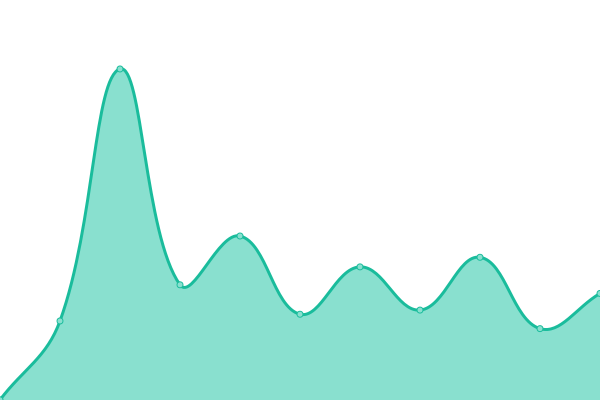 696ms
     
 | 

<a href="https://Certania.github.io/status-website/history/clarke-banks">99.26%</a>
    

|  [FIATEC](https://www.fiatec.com/) | 🟩 Up | [fiatec.yml](https://github.com/Certania/status-website/commits/HEAD/history/fiatec.yml) | 

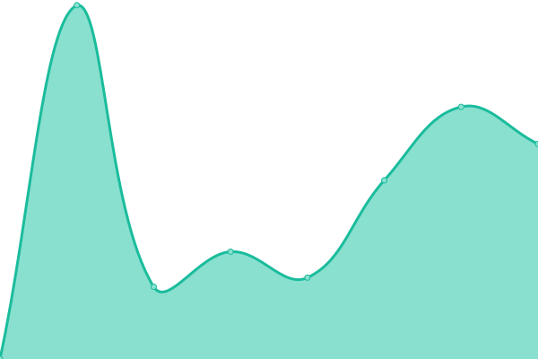 980ms
     
 | 

<a href="https://Certania.github.io/status-website/history/fiatec">100.00%</a>
    

|  [GWP](https://gwp.eu/) | 🟩 Up | [gwp.yml](https://github.com/Certania/status-website/commits/HEAD/history/gwp.yml) | 

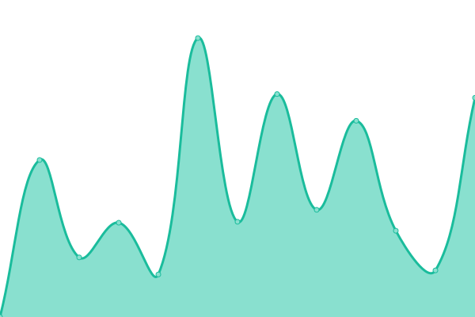 1434ms
     
 | 

<a href="https://Certania.github.io/status-website/history/gwp">100.00%</a>
    

|  [KÖTTER](https://koetter-consulting.com/) | 🟩 Up | [k-oe-tter.yml](https://github.com/Certania/status-website/commits/HEAD/history/k-oe-tter.yml) | 

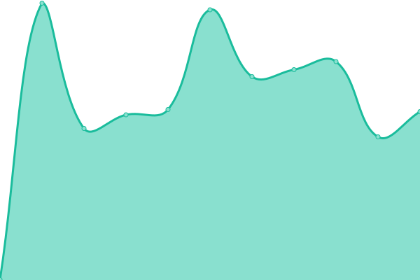 595ms
     
 | 

<a href="https://Certania.github.io/status-website/history/k-oe-tter">99.70%</a>
    

|  [MPR](https://www.mpr-international.com/) | 🟩 Up | [mpr.yml](https://github.com/Certania/status-website/commits/HEAD/history/mpr.yml) | 

 1541ms
     
 | 

<a href="https://Certania.github.io/status-website/history/mpr">99.08%</a>
    

|  [ÖHMI SERVICE](https://www.oehmi-service.de/) | 🟩 Up | [oe-hmi-service.yml](https://github.com/Certania/status-website/commits/HEAD/history/oe-hmi-service.yml) | 

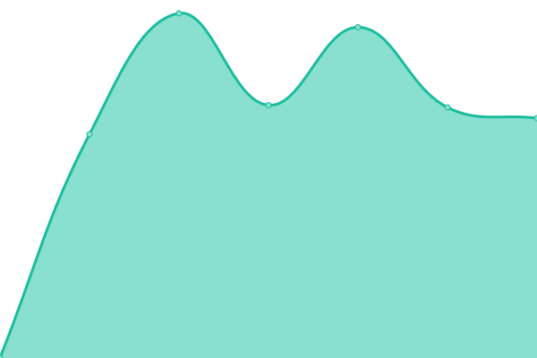 1283ms
     
 | 

<a href="https://Certania.github.io/status-website/history/oe-hmi-service">100.00%</a>
    

|  [RELIBELL](https://www.relibell.de/) | 🟩 Up | [relibell.yml](https://github.com/Certania/status-website/commits/HEAD/history/relibell.yml) | 

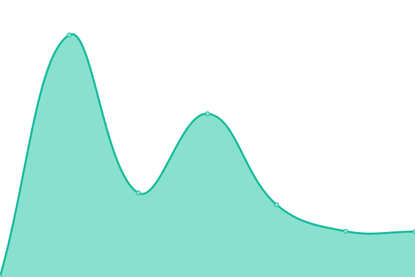 386ms
     
 | 

<a href="https://Certania.github.io/status-website/history/relibell">100.00%</a>
    

|  [SPC](https://spc-lab.de/) | 🟩 Up | [spc.yml](https://github.com/Certania/status-website/commits/HEAD/history/spc.yml) | 

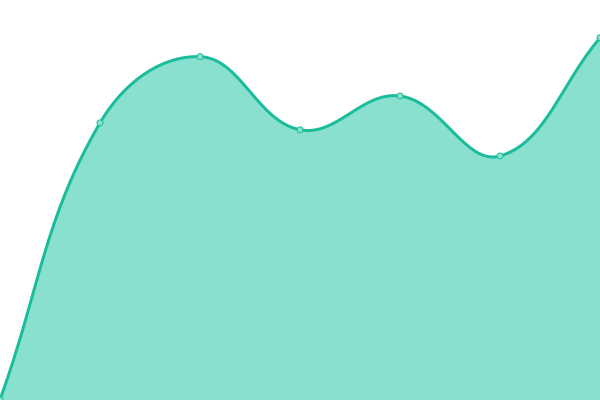 1214ms
     
 | 

<a href="https://Certania.github.io/status-website/history/spc">100.00%</a>
    

|  [TAZ](https://tazgmbh.de/) | 🟩 Up | [taz.yml](https://github.com/Certania/status-website/commits/HEAD/history/taz.yml) | 

 3679ms
     
 | 

<a href="https://Certania.github.io/status-website/history/taz">98.10%</a>
    

<!--end: status pages-->

[**Visit our status website →**](https://Certania.github.io/status-website)

## 📄 License

- Powered by: [Upptime](https://github.com/upptime/upptime)
- Code: [MIT](./LICENSE) © [Anand Chowdhary](https://anandchowdhary.com), supported by [Pabio](https://pabio.com)
- Data in the `./history` directory: [Open Database License](https://opendatacommons.org/licenses/odbl/1-0/)
