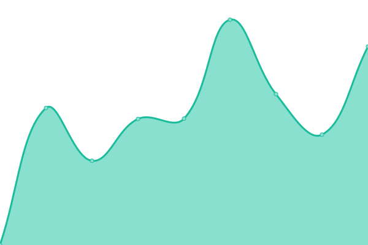
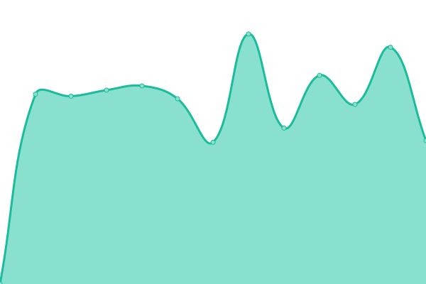

# [📈 Live Status](https://Certania.github.io/status-website): <!--live status--> **🟧 Partial outage**

This repository contains the open-source uptime monitor and status page for [CERTANIA](certania.com), powered by [Upptime](https://github.com/upptime/upptime).

With [Upptime](https://upptime.js.org), you can get your own unlimited and free uptime monitor and status page, powered entirely by a GitHub repository. We use [Issues](https://github.com/Certania/status-website/issues) as incident reports, [Actions](https://github.com/Certania/status-website/actions) as uptime monitors, and [Pages](https://Certania.github.io/status-website) for the status page.

<!--start: status pages-->
<!-- This summary is generated by Upptime (https://github.com/upptime/upptime) -->
<!-- Do not edit this manually, your changes will be overwritten -->
<!-- prettier-ignore -->
| URL | Status | History | Response Time | Uptime |
| --- | ------ | ------- | ------------- | ------ |
|  [CERTANIA](https://certania.com) | 🟩 Up | [certania.yml](https://github.com/Certania/status-website/commits/HEAD/history/certania.yml) | 

 850ms
     
 | 

<a href="https://Certania.github.io/status-website/history/certania">100.00%</a>
    

|  [ALPHALYTIK](https://www.alphalytik.com/) | 🟩 Up | [alphalytik.yml](https://github.com/Certania/status-website/commits/HEAD/history/alphalytik.yml) | 

 4641ms
     
 | 

<a href="https://Certania.github.io/status-website/history/alphalytik">100.00%</a>
    

|  [DINOX](https://www.dinox.de/) | 🟩 Up | [dinox.yml](https://github.com/Certania/status-website/commits/HEAD/history/dinox.yml) | 

 2028ms
     
 | 

<a href="https://Certania.github.io/status-website/history/dinox">100.00%</a>
    

|  [GBD](https://www.gbd-biotechdia.com/) | 🟩 Up | [gbd.yml](https://github.com/Certania/status-website/commits/HEAD/history/gbd.yml) | 

 1480ms
     
 | 

<a href="https://Certania.github.io/status-website/history/gbd">100.00%</a>
    

|  [ÖHMI Pharma](https://www.oehmi-analytik.de/leistungen/pharma-und-umweltlabor) | 🟩 Up | [oe-hmi-pharma.yml](https://github.com/Certania/status-website/commits/HEAD/history/oe-hmi-pharma.yml) | 

 1372ms
     
 | 

<a href="https://Certania.github.io/status-website/history/oe-hmi-pharma">100.00%</a>
    

|  [SOCRAMETRICS](https://socrametrics.com/) | 🟩 Up | [socrametrics.yml](https://github.com/Certania/status-website/commits/HEAD/history/socrametrics.yml) | 

 874ms
     
 | 

<a href="https://Certania.github.io/status-website/history/socrametrics">100.00%</a>
    

|  [SOCRATEC R&D](https://socratec-pharma.de/) | 🟩 Up | [socratec-r-and-d.yml](https://github.com/Certania/status-website/commits/HEAD/history/socratec-r-and-d.yml) | 

 1437ms
     
 | 

<a href="https://Certania.github.io/status-website/history/socratec-r-and-d">100.00%</a>
    

|  [SPINESERV](https://www.spineserv.de/) | 🟩 Up | [spineserv.yml](https://github.com/Certania/status-website/commits/HEAD/history/spineserv.yml) | 

 1809ms
     
 | 

<a href="https://Certania.github.io/status-website/history/spineserv">98.90%</a>
    

|  [BIOTEC](https://www.biotec-gmbh.com/) | 🟥 Down | [biotec.yml](https://github.com/Certania/status-website/commits/HEAD/history/biotec.yml) | 

 2567ms
     
 | 

<a href="https://Certania.github.io/status-website/history/biotec">99.99%</a>
    

|  [BIOTESYS](https://biotesys.de/) | 🟩 Up | [biotesys.yml](https://github.com/Certania/status-website/commits/HEAD/history/biotesys.yml) | 

 2849ms
     
 | 

<a href="https://Certania.github.io/status-website/history/biotesys">100.00%</a>
    

|  [ELAB-ANALYTIK](https://elab-analytik.de/) | 🟩 Up | [elab-analytik.yml](https://github.com/Certania/status-website/commits/HEAD/history/elab-analytik.yml) | 

 846ms
     
 | 

<a href="https://Certania.github.io/status-website/history/elab-analytik">100.00%</a>
    

|  [FSI HEALTH & SAFETY​](https://fsi.de/) | 🟩 Up | [fsi-health-and-safety.yml](https://github.com/Certania/status-website/commits/HEAD/history/fsi-health-and-safety.yml) | 

 1199ms
     
 | 

<a href="https://Certania.github.io/status-website/history/fsi-health-and-safety">100.00%</a>
    

|  [INSTITUT DR. NUSS](https://www.institut-nuss.de/) | 🟩 Up | [institut-dr-nuss.yml](https://github.com/Certania/status-website/commits/HEAD/history/institut-dr-nuss.yml) | 

 3016ms
     
 | 

<a href="https://Certania.github.io/status-website/history/institut-dr-nuss">100.00%</a>
    

|  [LABOSPORT](https://labosport.com/) | 🟩 Up | [labosport.yml](https://github.com/Certania/status-website/commits/HEAD/history/labosport.yml) | 

 644ms
     
 | 

<a href="https://Certania.github.io/status-website/history/labosport">100.00%</a>
    

|  [Mediator](https://www.mediator.as/) | 🟩 Up | [mediator.yml](https://github.com/Certania/status-website/commits/HEAD/history/mediator.yml) | 

 1977ms
     
 | 

<a href="https://Certania.github.io/status-website/history/mediator">100.00%</a>
    

|  [ÖHMI ANALYTIK](https://www.oehmi-analytik.de) | 🟩 Up | [oe-hmi-analytik.yml](https://github.com/Certania/status-website/commits/HEAD/history/oe-hmi-analytik.yml) | 

 1411ms
     
 | 

<a href="https://Certania.github.io/status-website/history/oe-hmi-analytik">100.00%</a>
    

|  [RAS-SCI](https://www.supplychainintegrity.eu) | 🟩 Up | [ras-sci.yml](https://github.com/Certania/status-website/commits/HEAD/history/ras-sci.yml) | 

 607ms
     
 | 

<a href="https://Certania.github.io/status-website/history/ras-sci">100.00%</a>
    

|  [SGI COMPLIANCE​](https://sgicompliance.com/) | 🟩 Up | [sgi-compliance.yml](https://github.com/Certania/status-website/commits/HEAD/history/sgi-compliance.yml) | 

 2089ms
     
 | 

<a href="https://Certania.github.io/status-website/history/sgi-compliance">99.37%</a>
    

|  [TRISKELION](https://www.triskelion.nl/) | 🟩 Up | [triskelion.yml](https://github.com/Certania/status-website/commits/HEAD/history/triskelion.yml) | 

 877ms
     
 | 

<a href="https://Certania.github.io/status-website/history/triskelion">100.00%</a>
    

|  [DFGE](https://dfge.de/) | 🟩 Up | [dfge.yml](https://github.com/Certania/status-website/commits/HEAD/history/dfge.yml) | 

 1232ms
     
 | 

<a href="https://Certania.github.io/status-website/history/dfge">100.00%</a>
    

|  [NATUREOFFICE](https://natureoffice.com/) | 🟩 Up | [natureoffice.yml](https://github.com/Certania/status-website/commits/HEAD/history/natureoffice.yml) | 

 1032ms
     
 | 

<a href="https://Certania.github.io/status-website/history/natureoffice">100.00%</a>
    

|  [CERTURIA](https://www.certuria.de/) | 🟩 Up | [certuria.yml](https://github.com/Certania/status-website/commits/HEAD/history/certuria.yml) | 

 1676ms
     
 | 

<a href="https://Certania.github.io/status-website/history/certuria">100.00%</a>
    

|  [IFU CERT](https://www.ifu-cert.de/) | 🟩 Up | [ifu-cert.yml](https://github.com/Certania/status-website/commits/HEAD/history/ifu-cert.yml) | 

 1690ms
     
 | 

<a href="https://Certania.github.io/status-website/history/ifu-cert">100.00%</a>
    

|  [ÖHMI EUROCERT](https://www.oehmi-cert.de/de/) | 🟩 Up | [oe-hmi-eurocert.yml](https://github.com/Certania/status-website/commits/HEAD/history/oe-hmi-eurocert.yml) | 

 1882ms
     
 | 

<a href="https://Certania.github.io/status-website/history/oe-hmi-eurocert">100.00%</a>
    

|  [CMC Sud](https://www.cmcsud.com/) | 🟩 Up | [cmc-sud.yml](https://github.com/Certania/status-website/commits/HEAD/history/cmc-sud.yml) | 

 3863ms
     
 | 

<a href="https://Certania.github.io/status-website/history/cmc-sud">100.00%</a>
    

|  [FIATEC](https://www.fiatec.com/) | 🟩 Up | [fiatec.yml](https://github.com/Certania/status-website/commits/HEAD/history/fiatec.yml) | 

 1538ms
     
 | 

<a href="https://Certania.github.io/status-website/history/fiatec">100.00%</a>
    

|  [GWP](https://gwp.eu/) | 🟩 Up | [gwp.yml](https://github.com/Certania/status-website/commits/HEAD/history/gwp.yml) | 

 1885ms
     
 | 

<a href="https://Certania.github.io/status-website/history/gwp">100.00%</a>
    

|  [KÖTTER](https://koetter-consulting.com/) | 🟩 Up | [k-oe-tter.yml](https://github.com/Certania/status-website/commits/HEAD/history/k-oe-tter.yml) | 

 1148ms
     
 | 

<a href="https://Certania.github.io/status-website/history/k-oe-tter">100.00%</a>
    

|  [MPR](https://www.mpr-international.com/) | 🟩 Up | [mpr.yml](https://github.com/Certania/status-website/commits/HEAD/history/mpr.yml) | 

 4617ms
     
 | 

<a href="https://Certania.github.io/status-website/history/mpr">100.00%</a>
    

|  [ÖHMI SERVICE](https://www.oehmi-service.de/) | 🟩 Up | [oe-hmi-service.yml](https://github.com/Certania/status-website/commits/HEAD/history/oe-hmi-service.yml) | 

 1413ms
     
 | 

<a href="https://Certania.github.io/status-website/history/oe-hmi-service">100.00%</a>
    

|  [RELIBELL](https://www.relibell.de/) | 🟩 Up | [relibell.yml](https://github.com/Certania/status-website/commits/HEAD/history/relibell.yml) | 

 1337ms
     
 | 

<a href="https://Certania.github.io/status-website/history/relibell">100.00%</a>
    

|  [SPC](https://spc-lab.de/) | 🟩 Up | [spc.yml](https://github.com/Certania/status-website/commits/HEAD/history/spc.yml) | 

 293ms
     
 | 

<a href="https://Certania.github.io/status-website/history/spc">100.00%</a>
    

|  [TAZ](https://tazgmbh.de/) | 🟩 Up | [taz.yml](https://github.com/Certania/status-website/commits/HEAD/history/taz.yml) | 

 2265ms
     
 | 

<a href="https://Certania.github.io/status-website/history/taz">99.73%</a>
    

<!--end: status pages-->

[**Visit our status website →**](https://Certania.github.io/status-website)

## 📄 License

- Powered by: [Upptime](https://github.com/upptime/upptime)
- Code: [MIT](./LICENSE) © [Anand Chowdhary](https://anandchowdhary.com), supported by [Pabio](https://pabio.com)
- Data in the `./history` directory: [Open Database License](https://opendatacommons.org/licenses/odbl/1-0/)
